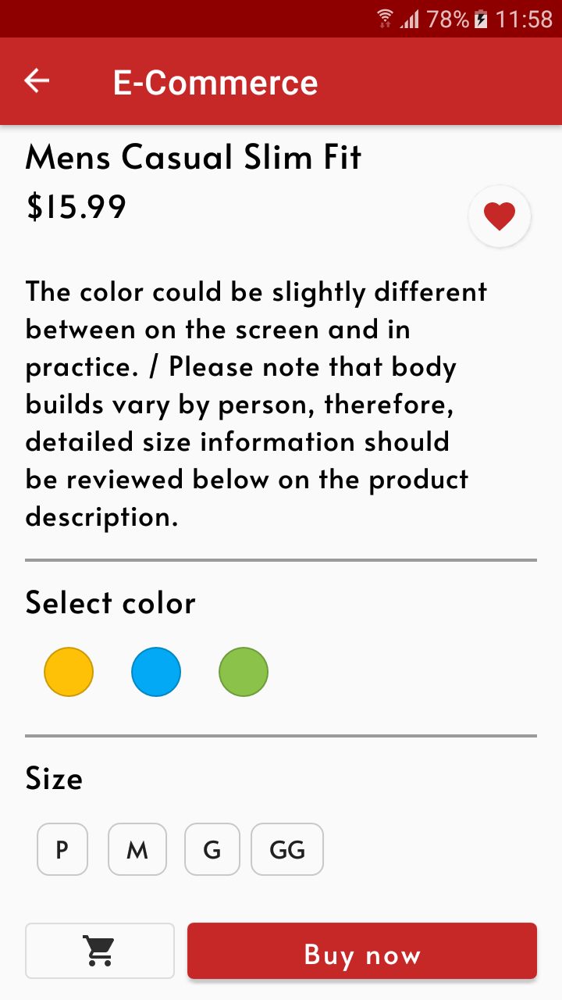
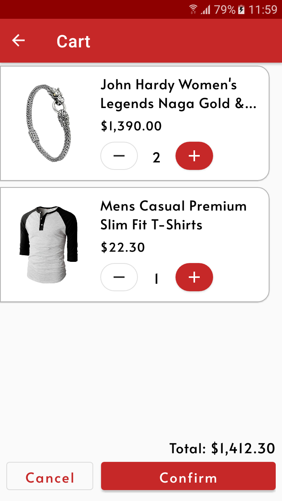

# AppCommerce

AppCommerce is an e-commerce app. Features a simple filterable product list where you can add products to your favorites to maybe buy them later or
simply add them to your cart to continue browsing. You can see your previous purchases and also login into a predefined user account. All remote data
comes from the FakeStoreApi, a free online REST API ([GitHub](https://github.com/keikaavousi/fake-store-api) / [Site](https://fakestoreapi.com/)).

## Architecture

Following Goggle recommended [app architecture and best practices](https://developer.android.com/topic/architecture), the app is structured in
a [Model-View-ViewModel (MVVM)](https://en.wikipedia.org/wiki/Model%E2%80%93view%E2%80%93viewmodel) pattern in conjunction with the Repository Pattern
acting as [Single Source Of Truth (SSOT)](https://en.wikipedia.org/wiki/Single_source_of_truth). The AppCommerce has a single activity that hosts all
fragments while the [Navigation](https://developer.android.com/guide/navigation) component handles the fragment
transactions. [ViewModels](https://developer.android.com/topic/libraries/architecture/viewmodel) separates business logic from UI to keep fragments
more organized.

## Screenshots

  
  
  
  

## Testing

Tests are written with [Espresso](https://developer.android.com/training/testing/espresso) and [Robolectric](https://robolectric.org/), also you can
run all tests together using [Suite](https://junit.org/junit4/javadoc/4.13/org/junit/runners/Suite.html) classes. The data layer components are
defined following the [Dependency Inversion Principles](https://pt.wikipedia.org/wiki/Princ%C3%ADpio_da_invers%C3%A3o_de_depend%C3%AAncia)
where each repository extends an interface and different implementations can be created for the production and testing code. Said implementations can
be found with the "Default-" and "Fake-" prefixes. This project also makes extensive use of rules and custom functions that allows testing fragments
while using Hilt dependency injection and waiting for a new LiveData value to be set. Coroutine dispatchers are also injectable with Hilt to increase
consistency in test results.

## Used Libraries

- [ViewModel](https://developer.android.com/topic/libraries/architecture/viewmodel)
- [LiveData](https://developer.android.com/topic/libraries/architecture/livedata)
- [Fragment](https://developer.android.com/guide/fragments)
- [Navigation](https://developer.android.com/guide/navigation)
- [RecyclerView](https://developer.android.com/develop/ui/views/layout/recyclerview)
- [ViewBinding](https://developer.android.com/topic/libraries/view-binding)
- [DataBinding](https://developer.android.com/topic/libraries/data-binding)
- [Binding Adapters](https://developer.android.com/topic/libraries/data-binding/binding-adapters)
- [Hilt Dependency Injection](https://dagger.dev/hilt/)
- [Retrofit](https://square.github.io/retrofit/)
- [Moshi](https://github.com/square/moshi/)
- [OkHttp](https://square.github.io/okhttp/)
- [Coroutines](https://kotlinlang.org/docs/coroutines-guide.html)
- [Flow](https://developer.android.com/kotlin/flow)
- [Glide](https://bumptech.github.io/glide/)
- [Preference Store](https://developer.android.com/topic/libraries/architecture/datastore)
- [Facebook's shimmer effect](https://github.com/facebook/shimmer-android)
- [Espresso](https://developer.android.com/training/testing/espresso)
- [Truth](https://truth.dev/)
- [Robolectric](https://robolectric.org/)

### Quick User References

| Username  | Password  |
|-----------|-----------|
| johnd     | m38rmF$   |
| mor_2314  | 83r5^_    |
| kevinryan | kev02937@ |

### Image References

#### Icons

[Diamond Ring Icon](https://icons8.com/icon/19632/diamond-ring)

[T-Shirt Icon](https://icons8.com/icon/105819/t-shirt)

[Womens T-Shirt Icon](https://icons8.com/icon/25497/womens-t-shirt)

[Tech Icon](https://icons8.com/icon/ifjgL624vDhJ/technology)

#### Banners

[Woman Fashion banner](https://www.freepik.com/photos/happy-moments)

[Male fashion banner](https://www.freepik.com/free-photo/business-man-coat-talking-phone-outside_1619086.htm#query=male%20fashion&position=43&from_view=keyword)

[Electronics banner](https://www.freepik.com/free-photo/beautiful-young-woman-home-office-working-from-home-teleworking-concept_11013620.htm#query=coffee%20work&position=10&from_view=keyword")